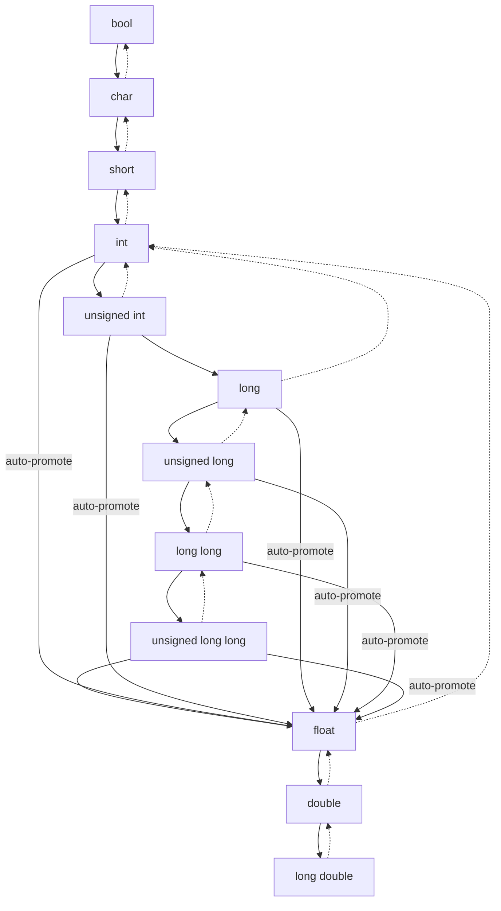

#### 🎨 Diagram: Types Hierarchy 
 ♻️ (*MinGW, Windows11, Codelite*)   
 ⌚7:34 pm  📆 Mon Jul 28
 🔗 **Related Concepts**: #cpp #diagram
___

- `-->` **Promotion** (automatic widening, safe)
    
- `..>` **Demotion** (narrowing, explicit cast required, may lose data)